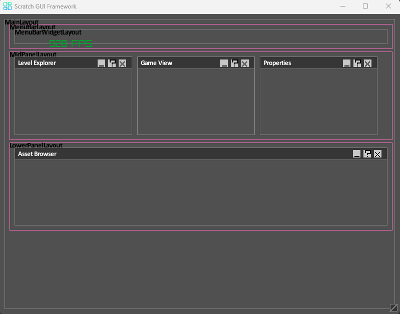

<h1 align="center" style="bold">Scratch</h1>
<p align="center"> </img></p>
<H2 align="center"> A simple GUI Framework for Go based applications</H2>
<p>
</p>

<H2 align="left">Features -</H2>
<p>
<ul>
  <li>Easy Nested Layouts</li>
  <li>Built-In Widgets</li>
  <li>Customizable TitleBar</li>
  <li>MDI Child Windows</li>
</ul>
 </p>
 <p>
 
 </p>
<H2 align="left">Examples -</H2>
  <script>
            hljs.highlightAll();
        </script>

## Examples

```go
package main

import (
	"scratch/RayGui"
	rl "github.com/gen2brain/raylib-go/raylib"
)

func create_scratch_window() *RayGui.BaseWidget {
	// Initialize fonts
	RayGui.InitializeFonts()

	// Create main widget (fills entire window)
	mainWidget := RayGui.NewBaseWidget("MainWindow")
	mainWidget.Layout.Name = "MainLayout"
	mainWidget.IsMainWindow = true
	mainWidget.TitleBar = true
	mainWidget.Layout.Type = RayGui.LayoutVertical
	mainWidget.Layout.Padding = rl.NewVector2(5, 5)
	mainWidget.Layout.Spacing = 5

	// Layouts
	menubarLayout := RayGui.NewLayout()
	menubarLayout.Name = "MenuBarLayout"
	menubarLayout.Type = RayGui.LayoutHorizontal
	mainWidget.Layout.AddLayout(menubarLayout)

	midPanelLayout := RayGui.NewLayout()
	midPanelLayout.Name = "MidPanelLayout"
	midPanelLayout.Type = RayGui.LayoutHorizontal
	mainWidget.Layout.AddLayout(midPanelLayout)

	lowerPanelLayout := RayGui.NewLayout()
	lowerPanelLayout.Name = "LowerPanelLayout"
	lowerPanelLayout.Type = RayGui.LayoutVertical
	mainWidget.Layout.AddLayout(lowerPanelLayout)

	// MenuBar Widget
	menubar := RayGui.NewBaseWidget("Menubar")
	menubar.Layout.Name = "MenuBarWidgetLayout"
	menubar.TitleBar = false
	menubar.TitleBarColor = rl.NewColor(255, 255, 255, 0)
	menubar.BgColor = rl.NewColor(255, 255, 255, 0)
	menubar.DrawBackground = true
	menubar.Layout.FixedHeight = 50
	menubarLayout.AddChild(menubar)

	// level Explorer
	levelExplorer := RayGui.NewBaseWidget("Level Explorer")
	midPanelLayout.AddChild(levelExplorer)

	// RenderPanel
	renderPanel := RayGui.NewBaseWidget("Game View")
	midPanelLayout.AddChild(renderPanel)

	// PropertiesPanel
	propertiesPanel := RayGui.NewBaseWidget("Properties")
	midPanelLayout.AddChild(propertiesPanel)

	// Asset Browser
	assetBrowser := RayGui.NewBaseWidget("Asset Browser")
	lowerPanelLayout.AddChild(assetBrowser)

	return mainWidget
}

func main() {
	rl.SetConfigFlags(rl.FlagWindowResizable | rl.FlagWindowTopmost)
	rl.InitWindow(800, 600, "Scratch GUI Framework")

	mainWidget := create_scratch_window()

	for !rl.WindowShouldClose() {
		rl.BeginDrawing()
		rl.ClearBackground(RayGui.Default_Bg_Color)

		mainWidget.Update()
		mainWidget.Draw()
		rl.DrawFPS(100, 50)
		rl.EndDrawing()
	}

	mainWidget.Unload()
	rl.CloseWindow()
}
```
